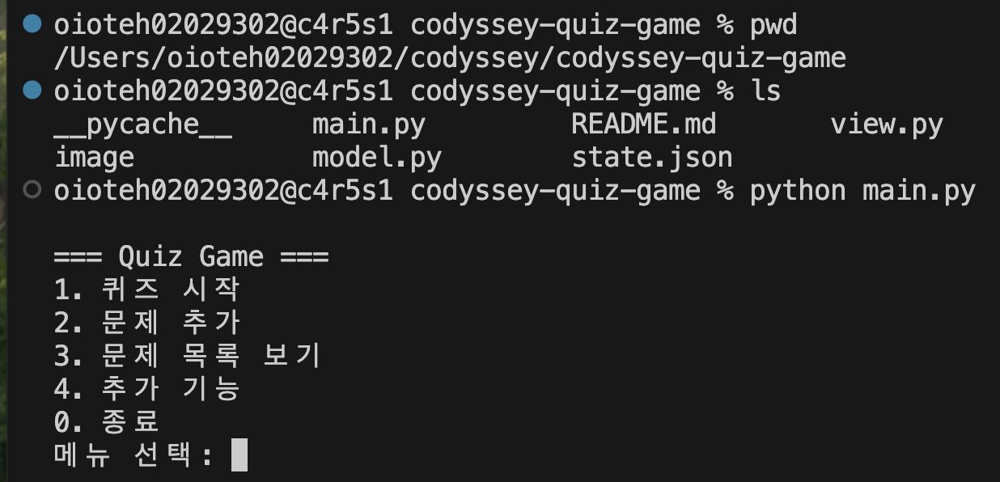
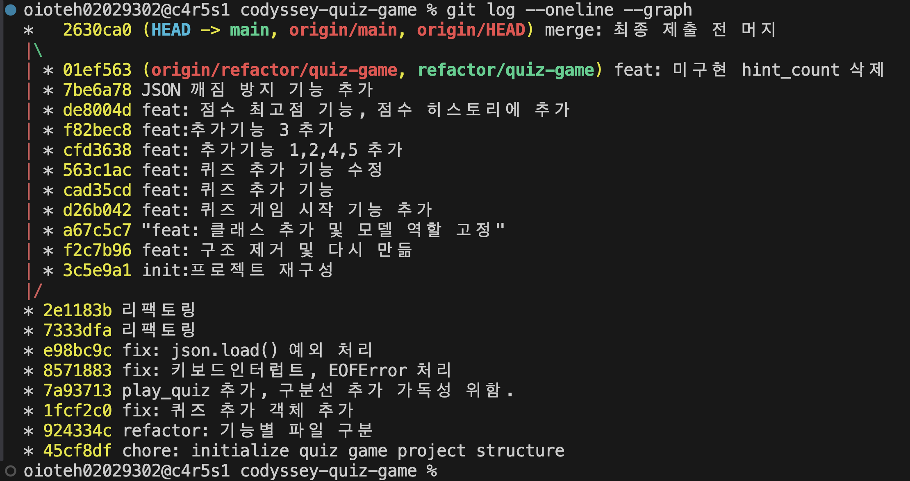

# Python CLI Quiz Game

## 1. 프로젝트 개요

이 프로젝트는 터미널에서 실행되는 Python CLI 퀴즈 게임입니다.  
사용자는 메뉴를 통해 퀴즈를 시작하거나 이어서 진행할 수 있고, 새로운 문제를 추가하거나 저장된 문제 목록을 확인할 수 있습니다.  
또한 랜덤 출제, 문제 수 선택, 힌트 설정, 문제 삭제, 점수 히스토리 확인 같은 추가 기능도 제공합니다.  
프로그램에서 사용하는 문제 데이터와 설정값, 현재 진행 상태, 플레이 기록은 프로젝트 루트의 `state.json` 파일에 저장되어 프로그램을 다시 실행해도 이어서 사용할 수 있도록 구성했습니다.

## 2. 퀴즈 주제와 선정 이유

퀴즈 주제는 Python 기초 문법으로 정했습니다.  
기본 자료형, 내장 함수, 반복문, 딕셔너리, 함수 정의처럼 Python을 처음 학습할 때 자주 접하는 개념을 문제로 구성했습니다.  
이 주제를 선택한 이유는, 터미널 기반 퀴즈 게임을 구현하면서 Python 문법 자체도 함께 복습할 수 있도록 하기 위해서입니다.  
또한 정답이 비교적 명확한 개념들로 문제를 만들 수 있어, 객관식 퀴즈 형식에 적합하다고 판단했습니다.

## 3. 실행 방법


## 4. 기능 목록

- 퀴즈 시작 및 이어하기  
  저장된 세션이 있으면 이어서 진행할 수 있고, 없으면 새 퀴즈를 시작할 수 있습니다.

- 새로운 문제 추가  
  문제, 보기 4개, 정답 번호, 힌트를 입력해 새로운 문제를 등록할 수 있습니다.

- 문제 목록 보기  
  현재 저장된 문제의 목록을 확인할 수 있습니다.

- 추가 기능 메뉴  
  랜덤 출제 설정, 문제 수 선택, 힌트 설정, 문제 삭제, 점수 히스토리 보기를 제공합니다.

- 입력 검증 및 예외 처리  
  빈 입력, 숫자 변환 실패, 허용 범위 밖 입력을 검사하고 다시 입력받도록 처리했습니다.  
  또한 프로그램 실행 중 `Ctrl+C` 또는 `EOFError`가 발생해도 가능한 범위에서 저장 후 안전하게 종료하도록 구성했습니다.

- state.json 기반 상태 저장  
  문제 데이터, 설정값, 진행 중 세션, 플레이 기록을 `state.json`에 저장하고 다시 불러올 수 있습니다.

## 5. 파일 구조

codyssey-quiz-game
├── main.py       # Controller: 프로그램 전체 흐름 제어
├── model.py      # Model: 퀴즈 데이터, 게임 상태, 파일 저장/불러오기
├── view.py       # View: CLI 출력 및 사용자 입력 처리
└── state.json    # 데이터 저장 파일

구조 설명

- main.py
    - QuizController
        - 프로그램 시작 시 state.json을 불러옵니다.
        - 메인 메뉴를 반복 출력하고, 사용자의 선택에 따라 기능을 실행합니다.
        - 퀴즈 시작/이어하기, 문제 추가, 문제 목록 보기, 추가 기능 메뉴 진입, 종료 흐름을 제어합니다.
        - 퀴즈 진행 중 답안 기록, 결과 처리, 세션 저장을 담당합니다.

- model.py
    - QuizQuestion
        - 문제 1개를 표현하는 데이터 클래스입니다.
        - 문제 문장, 보기 4개, 정답 번호, 힌트 정보를 가집니다.
        - 문제 데이터가 유효한지 검사하고, JSON 저장용 딕셔너리 변환 기능을 제공합니다.
    - GameState
        - 현재 진행 중인 게임 상태를 저장하는 클래스입니다.
        - 진행 여부, 출제된 문제 id 목록, 현재 문제 위치, 맞힌 개수, 답안 기록, 옵션 정보를 관리합니다.
        - 새 게임 시작, 답안 기록, 종료 여부 판단, 상태 초기화 기능을 제공합니다.
    - QuestionBank
        - 전체 문제 목록을 관리하는 클래스입니다.
        - 기본 문제 세트를 제공하고, 전체 문제 조회 / id로 문제 찾기 / 문제 추가 / 문제 삭제 / 다음 id 계산 기능을 담당합니다.
        - 랜덤 출제 여부와 문제 수 설정에 따라 실제 출제할 문제 id 목록을 구성합니다.
    - StateStore
        - state.json 파일의 저장과 불러오기를 담당하는 클래스입니다.
        - 프로그램 시작 시 저장된 데이터를 읽어 문제 목록, 현재 세션, 설정값, 기록을 복원합니다.
        - 프로그램 진행 중 변경된 내용을 다시 state.json에 저장합니다.

- view.py
    - CLIView
        - 터미널 화면 출력과 사용자 입력 처리를 담당하는 클래스입니다.
        - 메인 메뉴, 추가 기능 메뉴, 문제, 결과, 기록을 출력합니다.
        - 메뉴 번호, 정답 번호, 새 문제 입력 시 빈 입력 / 숫자 변환 실패 / 범위 이탈을 검사합니다.


## 6. 데이터 파일 설명 (state.json)
이 프로젝트는 프로젝트 루트의 `state.json` 파일을 사용해 데이터를 저장합니다.  
이 파일에는 문제 목록, 설정값, 현재 진행 중인 세션 정보, 플레이 기록이 저장됩니다.  
프로그램을 다시 실행했을 때 이전에 저장한 데이터를 불러올 수 있도록 `UTF-8` 인코딩으로 읽고 씁니다.

### 역할

- 등록된 문제 목록 저장
- 랜덤 출제, 문제 수, 힌트 설정 저장
- 진행 중인 퀴즈 세션 상태 저장
- 플레이 기록 저장

### 주요 데이터 구조

- `questions`
  - 문제 목록입니다.
  - 각 문제는 `id`, `question`, `choices`, `answer`, `hint` 정보를 가집니다.

- `settings`
  - 퀴즈 진행 옵션을 저장합니다.
  - `random_enabled`, `question_count`, `hint_enabled` 값을 사용합니다.

- `current_session`
  - 현재 진행 중인 게임 상태를 저장합니다.
  - 진행 여부, 현재 문제 위치, 맞힌 개수, 답안 기록 등을 포함합니다.

- `history`
  - 이전 플레이 기록 목록입니다.
  - 플레이 시각, 푼 문제 수, 정답 수, 오답 수, 옵션 정보 등을 저장할 수 있습니다.

### 예시 스키마

```json
{
  "version": 1,
  "questions": [
    {
      "id": 1,
      "question": "Python에서 리스트 길이를 구하는 함수는?",
      "choices": ["size()", "count()", "len()", "length()"],
      "answer": 3,
      "hint": "내장 함수다."
    }
  ],
  "settings": {
    "random_enabled": true,
    "question_count": null,
    "hint_enabled": true
  },
  "current_session": {
    "in_progress": false,
    "question_ids": [],
    "current_index": 0,
    "correct_count": 0,
    "answers": [],
    "options": {}
  },
  "history": []
}
```


## 7. Git 작업 기록


